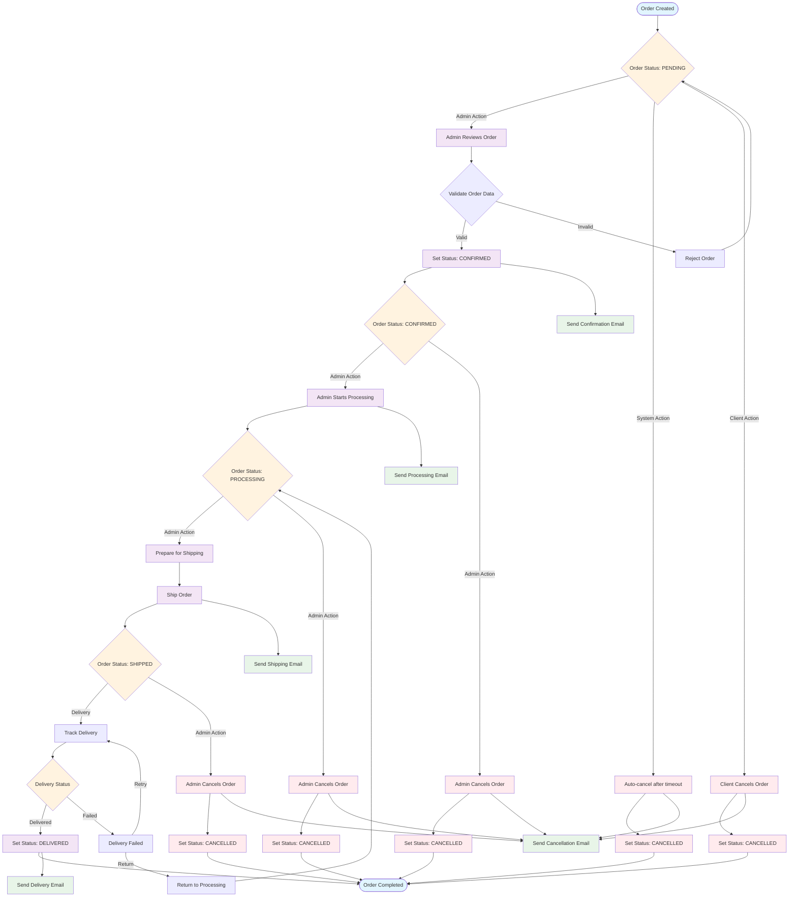

# Activity Diagram - Order Status Workflow

## Order Status Workflow Description

### 1. **Order Creation (PENDING)**
- Order is created with status "PENDING"
- System validates order data and inventory
- Order awaits admin review and confirmation

### 2. **Order Confirmation (CONFIRMED)**
- Admin reviews order details
- Validates shipping information and payment
- Confirms order and sets status to "CONFIRMED"
- Customer receives confirmation email

### 3. **Order Processing (PROCESSING)**
- Admin starts processing the order
- Items are prepared for shipment
- Inventory is allocated and reserved
- Customer receives processing notification

### 4. **Order Shipping (SHIPPED)**
- Order is packaged and shipped
- Tracking information is generated
- Status is updated to "SHIPPED"
- Customer receives shipping notification with tracking details

### 5. **Order Delivery (DELIVERED)**
- Package is delivered to customer
- Delivery confirmation is received
- Status is updated to "DELIVERED"
- Customer receives delivery confirmation

### 6. **Order Cancellation**
- Can be cancelled at any stage before delivery
- Cancellation reasons:
  - Client-initiated cancellation
  - Admin-initiated cancellation
  - Auto-cancellation (timeout)
  - Delivery failure and return

## Status Transitions

### Valid Transitions
- PENDING → CONFIRMED (admin action)
- PENDING → CANCELLED (client/admin/timeout)
- CONFIRMED → PROCESSING (admin action)
- CONFIRMED → CANCELLED (admin action)
- PROCESSING → SHIPPED (admin action)
- PROCESSING → CANCELLED (admin action)
- SHIPPED → DELIVERED (delivery confirmation)
- SHIPPED → CANCELLED (admin action)
- Any status → CANCELLED (cancellation)

### Invalid Transitions
- DELIVERED → Any other status (final state)
- CANCELLED → Any other status (final state)
- SHIPPED → PROCESSING (cannot go backwards)
- DELIVERED → SHIPPED (cannot go backwards)

## Business Rules

### Auto-Cancellation
- Orders in PENDING status for more than 24 hours
- Automatic cancellation with notification
- Inventory is released back to stock

### Delivery Retry
- Failed deliveries can be retried
- Maximum 3 delivery attempts
- After 3 failures, order returns to PROCESSING

### Inventory Management
- Stock is reserved when order is CONFIRMED
- Stock is released if order is CANCELLED
- Stock is reduced when order is SHIPPED

### Notification Triggers
- Status change notifications are sent to customers
- Admin notifications for critical status changes
- Email notifications for all status transitions

## Error Handling

### Validation Errors
- Invalid order data prevents confirmation
- Missing shipping information blocks processing
- Payment issues prevent order confirmation

### System Errors
- Database connection issues
- Email service failures
- Inventory system errors

### Recovery Actions
- Retry failed operations
- Manual intervention for stuck orders
- Rollback inventory changes on errors
