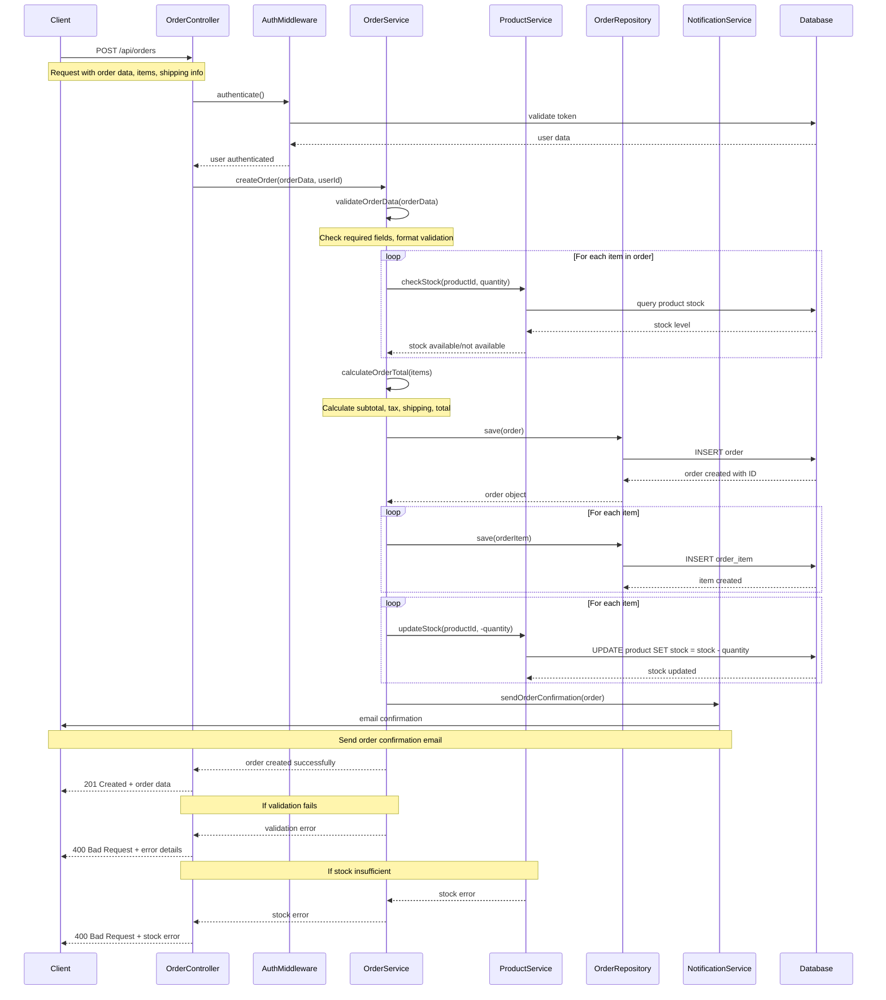

# Sequence Diagram - Order Creation Flow

## Order Creation Flow Description

### 1. **Authentication Phase**
- Client sends POST request to `/api/orders`
- AuthMiddleware validates the JWT token
- User authentication is verified

### 2. **Validation Phase**
- OrderService validates the order data structure
- Checks required fields (items, shipping address, totals)
- Validates data formats and business rules

### 3. **Product Validation**
- For each item in the order:
  - ProductService checks if product exists
  - Verifies sufficient stock is available
  - Validates product options (size, color)

### 4. **Calculation Phase**
- OrderService calculates order totals:
  - Subtotal (sum of item prices × quantities)
  - Tax calculation
  - Shipping costs
  - Final total

### 5. **Order Creation**
- OrderRepository saves the order to database
- Order items are created and linked to the order
- Order status is set to "PENDING"

### 6. **Inventory Update**
- Product stock is reduced for each ordered item
- Stock levels are updated in the database

### 7. **Notification**
- NotificationService sends order confirmation email
- Client receives confirmation of successful order creation

### 8. **Response**
- API returns 201 Created with order details
- Client receives complete order information including order ID

## Error Scenarios

### Validation Errors
- Missing required fields
- Invalid data formats
- Business rule violations

### Stock Errors
- Insufficient product stock
- Product not available
- Invalid product options

### System Errors
- Database connection issues
- Service unavailability
- Network timeouts
