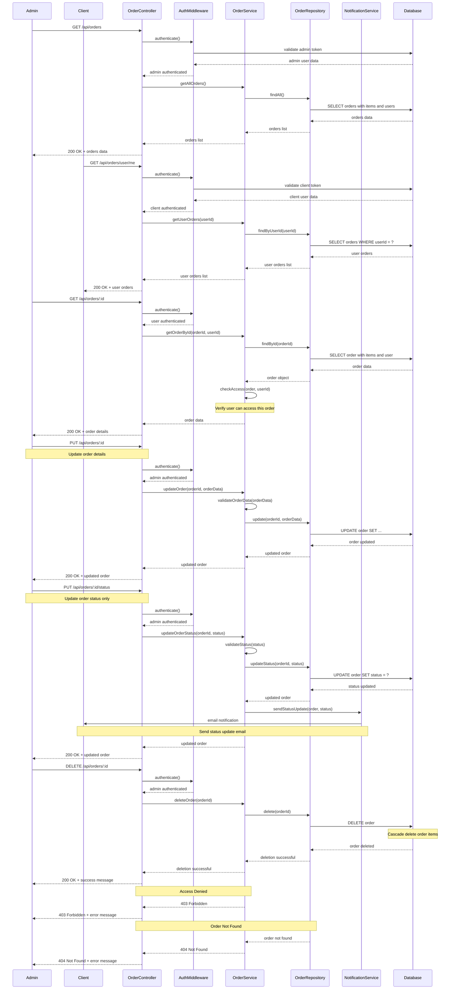

# Sequence Diagram - Order Management Flow

## Order Management Flow Description

### 1. **Get All Orders (Admin)**
- Admin requests all orders in the system
- Authentication verifies admin role
- OrderService retrieves all orders with related data
- Returns complete order list with items and user information

### 2. **Get User Orders (Client)**
- Client requests their own orders
- Authentication verifies client identity
- OrderService retrieves orders for specific user
- Returns filtered order list for the authenticated user

### 3. **Get Specific Order**
- Admin or order owner requests specific order details
- Authentication verifies user identity
- OrderService retrieves order by ID
- Access control verifies user can view this order
- Returns detailed order information

### 4. **Update Order (Admin)**
- Admin updates order details (shipping, payment info)
- Authentication verifies admin role
- OrderService validates update data
- OrderRepository updates order in database
- Returns updated order information

### 5. **Update Order Status (Admin)**
- Admin changes order status (pending → confirmed → shipped → delivered)
- Authentication verifies admin role
- OrderService validates status transition
- OrderRepository updates status in database
- NotificationService sends status update to customer
- Returns updated order with new status

### 6. **Delete Order (Admin)**
- Admin removes order from system
- Authentication verifies admin role
- OrderService deletes order and related items
- Database cascade deletes order items
- Returns confirmation of successful deletion

## Access Control Rules

### Admin Access
- Can view all orders
- Can update any order
- Can change order status
- Can delete orders
- Can access order management endpoints

### Client Access
- Can view only their own orders
- Can view details of their own orders
- Cannot modify orders
- Cannot access admin-only endpoints

## Error Handling

### Authentication Errors
- Invalid or expired tokens
- Missing authentication headers
- Unauthorized access attempts

### Authorization Errors
- Client trying to access admin functions
- User trying to access another user's orders
- Insufficient permissions for operation

### Data Errors
- Order not found
- Invalid order data
- Invalid status transitions
- Database constraint violations
