# Use Case Diagram - Orders Management System

```mermaid
graph TB
    %% Actors
    Client[👤 Client]
    Admin[👤 Admin]
    System[🖥️ System]
    
    %% Use Cases
    subgraph "Order Management"
        UC1[Create Order]
        UC2[View Own Orders]
        UC3[View Order Details]
        UC4[Track Order Status]
    end
    
    subgraph "Admin Order Management"
        UC5[View All Orders]
        UC6[Update Order Details]
        UC7[Update Order Status]
        UC8[Delete Order]
        UC9[Manage Order Items]
    end
    
    subgraph "System Operations"
        UC10[Calculate Order Total]
        UC11[Validate Order Data]
        UC12[Process Payment]
        UC13[Send Order Notifications]
        UC14[Update Inventory]
    end
    
    %% Client relationships
    Client --> UC1
    Client --> UC2
    Client --> UC3
    Client --> UC4
    
    %% Admin relationships
    Admin --> UC5
    Admin --> UC6
    Admin --> UC7
    Admin --> UC8
    Admin --> UC9
    
    %% System relationships
    UC1 --> UC10
    UC1 --> UC11
    UC1 --> UC12
    UC1 --> UC13
    UC1 --> UC14
    
    UC6 --> UC11
    UC7 --> UC13
    
    %% Include relationships
    UC1 -.->|includes| UC10
    UC1 -.->|includes| UC11
    UC1 -.->|includes| UC12
    
    %% Extend relationships
    UC2 -.->|extends| UC3
    UC5 -.->|extends| UC6
    UC5 -.->|extends| UC7
```

## Use Case Descriptions

### Client Use Cases
- **UC1: Create Order** - Client creates a new order with items, shipping info, and payment
- **UC2: View Own Orders** - Client views list of their orders
- **UC3: View Order Details** - Client views detailed information of a specific order
- **UC4: Track Order Status** - Client monitors the current status of their orders

### Admin Use Cases
- **UC5: View All Orders** - Admin views all orders in the system
- **UC6: Update Order Details** - Admin modifies order information (shipping, payment, etc.)
- **UC7: Update Order Status** - Admin changes order status (pending, confirmed, shipped, etc.)
- **UC8: Delete Order** - Admin removes orders from the system
- **UC9: Manage Order Items** - Admin adds/removes/modifies items in orders

### System Use Cases
- **UC10: Calculate Order Total** - System calculates subtotal, tax, shipping, and total
- **UC11: Validate Order Data** - System validates order information and business rules
- **UC12: Process Payment** - System handles payment processing
- **UC13: Send Order Notifications** - System sends status updates to clients
- **UC14: Update Inventory** - System adjusts product stock levels
